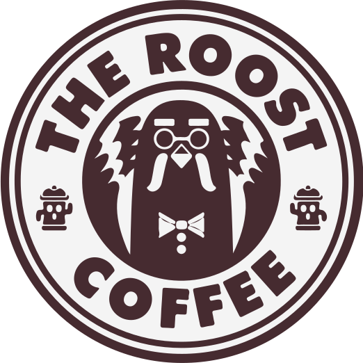
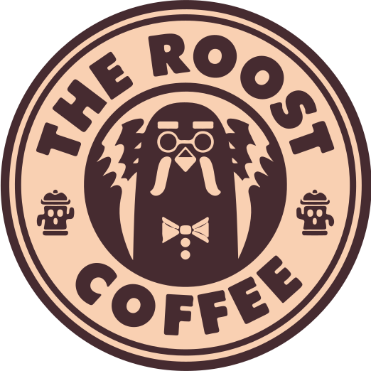
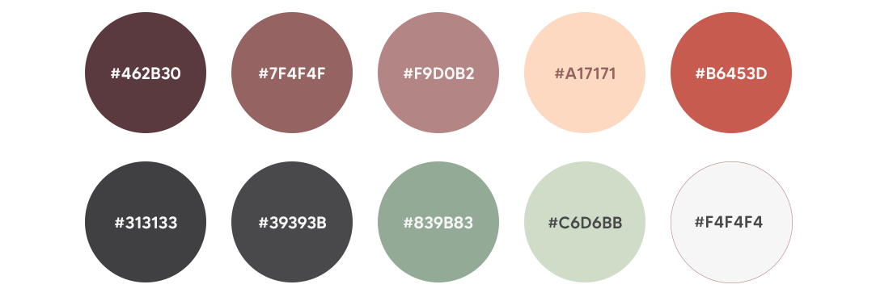

# Logotipo

{.logo}  {.logo} {.logo} {.logo}
El imagotipo recurre a tangencias con circunferencias y elipses, tomando ciertas licencias creativas en algunos detalles para su construcción.
De izquierda a derecha se ofrecen las distintas versiones del imagotipo, siendo su versión principal la primera empezando por la izquierda.
El área de protección queda determinada por **un centímetro** alrededor de este, siempre pudiendo aumentarse mientras no incida en el logotipo o rompa la estética predefinida.

# Tipografía Corporativa

La tipografía empleada será **Made Tommy Soft**, siendo una tipografía sans-serif, siguiendo además el modelo lineal geométrico de esquinas redondeadas según la clasificación Vox-A-Typi.
Esta tipografía está diseñada por MadeType.

En su uso para el desarrollo de la línea gráfica utilizaremos dentro de la familia tipográfica las fuentes **Black, Bold y Regular**. Sus tamaños variarán en base a la importancia entre títulos, títulos de secciones y párrafos.

# Ejemplo de Tipografía → H1

## Ejemplo de Tipografía → H2

### Ejemplo de Tipografía → H3

#### Ejemplo de Tipografía → H4

##### Ejemplo de Tipografía → H5

###### Ejemplo de Tipografía → H6

Ejemplo de Tipografía → P

[Enlace a la tipografía](https://creativemarket.com/MadeType/4689694-MADE-Tommy-Soft-60-Off)

# Paleta de Color

# Prototipo

[Enlace al Prototipo · Figma](https://www.figma.com/proto/AfmPnRmdR0KCDwBou08nND/The-Roost-Coffee-Shop?node-id=14%3A2&scaling=scale-down&page-id=0%3A1&starting-point-node-id=14%3A2)

 

---

[← Volver](https://paolaski.github.io/the-roost-wiki.github.io/){.link--green .link--bold}
