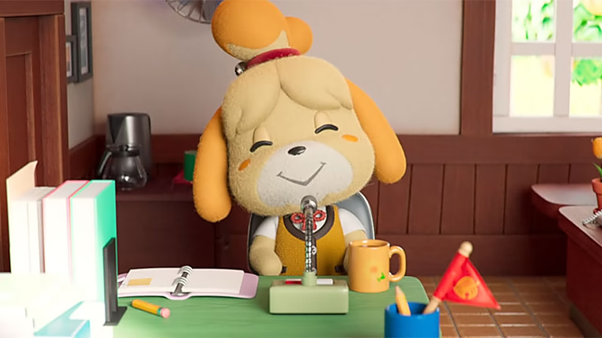

{.img}

Empezamos este proyecto el día 12/12/21 y lo entregamos 22/12/21. Apenas 10 días de trabajo en los que prácticamente el equipo de desarrollo ha estado sin dormir pero disfruntando juntos del proceso. Ya antes éramos compañeros pero ahora podemos decir que somos amigos.

Hemos encontrado problemas que aún nos penalizan, principalmente en los tiempos y poder sincronizarnos a la hora de trabajar, pero la asincronía nos ha hecho más fuertes para poder lidiar con ello de la mejor forma.

El siguiente problema también tiene que ver con el tiempo, ya que nos exigimos una calidad excelsa en todos nuestros ámbitos, y esto incluye nuestro código, para ello nos tocaría ser rigurosos en el aprendizaje de las tecnologías a implementar, pero dado el margen, nos ha sido imposible ahondar más en estas, ¡tenemos un checklist denso para 2022!

 

---

[← Volver](https://paolaski.github.io/the-roost-wiki.github.io/){.link--green .link--bold}
